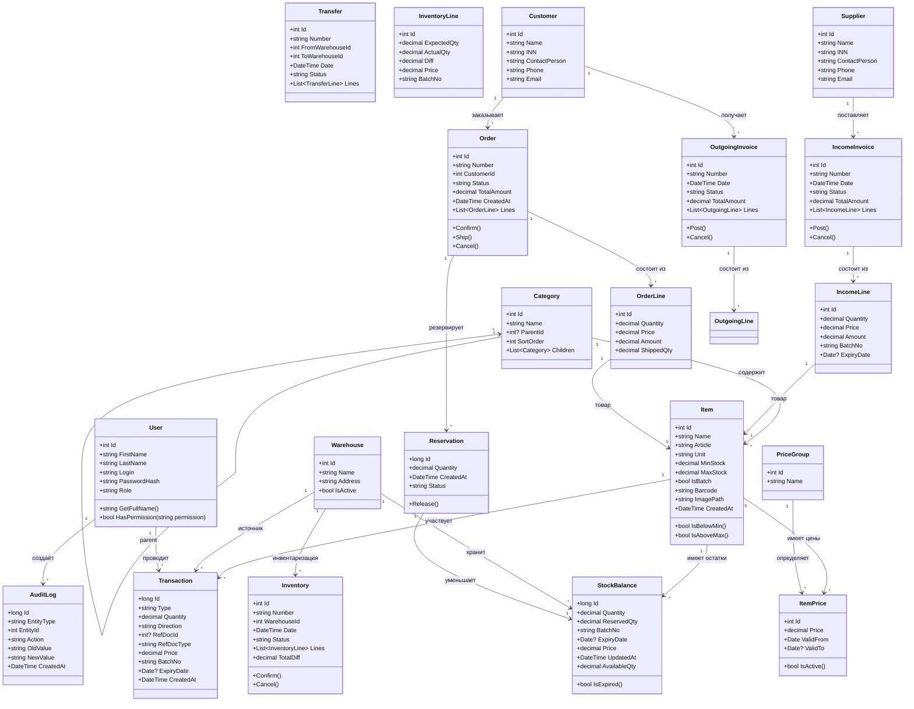
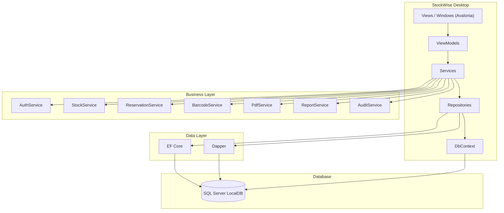
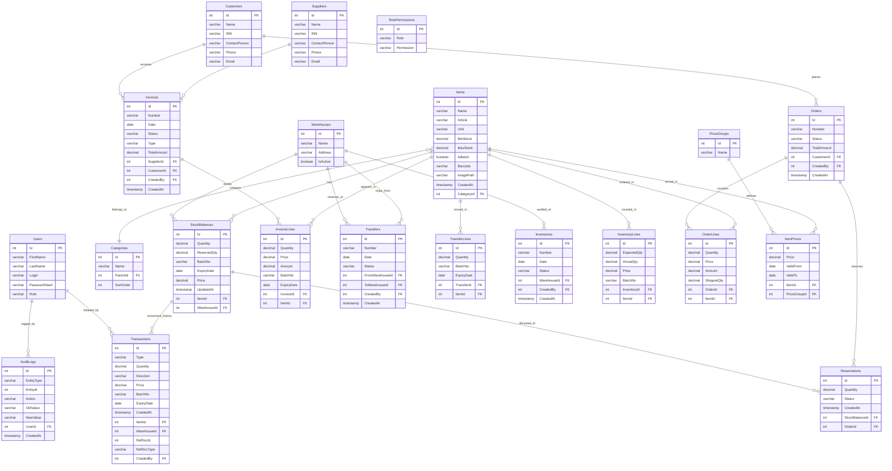
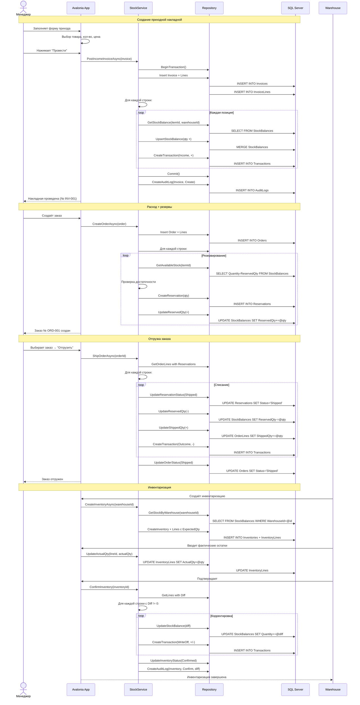
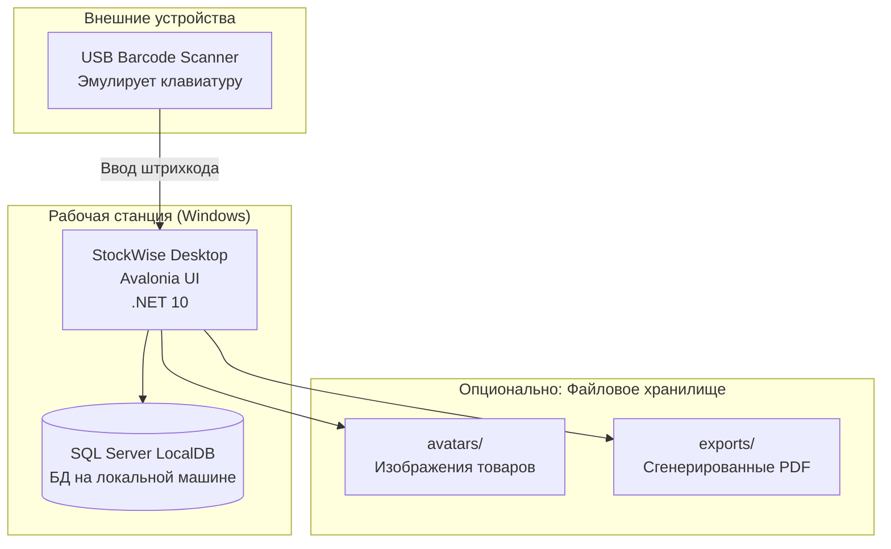
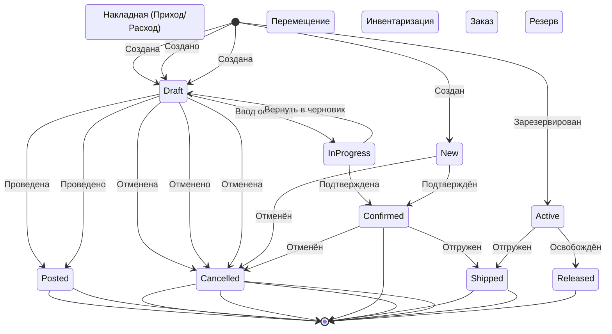

# StockWise — UML документация системы складского учёта

**Стек:** C# Avalonia Desktop | .NET 10 | EF Core + Dapper | SQL Server LocalDB | MVVM | QuestPDF | ZXing.Net

---

## 1. Use Case диаграмма

```mermaid
graph TB
    Manager((Менеджер)) -->|Авторизация| Login
    Manager -->|Управление номенклатурой| ManageItems
    Manager -->|Создать товар| CreateItem
    Manager -->|Редактировать товар| EditItem
    Manager -->|Просмотр остатков| ViewStock
    Manager -->|Приход товара| CreateIncome
    Manager -->|Расход товара| CreateOutcome
    Manager -->|Перемещение между складами| CreateTransfer
    Manager -->|Создание заказа клиенту| CreateOrder
    Manager -->|Резервирование товара| ReserveItem
    Manager -->|Отгрузка заказа| ShipOrder
    Manager -->|Просмотр отчётов| ViewReports
    Manager -->|ABC-анализ| AbcAnalysis
    Manager -->|Оборотно-сальдовая| TurnoverReport
    Manager -->|Подбор товара по штрихкоду| ScanBarcode

    Warehouse((Кладовщик)) -->|Авторизация| Login
    Warehouse -->|Инвентаризация| DoInventory
    Warehouse -->|Создать инвентаризацию| CreateInventory
    Warehouse -->|Ввести фактические остатки| EnterFact
    Warehouse -->|Подтвердить расхождения| ConfirmDiff
    Warehouse -->|Перемещение| CreateTransfer
    Warehouse -->|Просмотр остатков| ViewStock

    Admin((Администратор)) -->|Все действия Manager| AllManagerActions
    Admin -->|Управление пользователями| ManageUsers
    Admin -->|Управление складами| ManageWarehouses
    Admin -->|Управление категориями| ManageCategories
    Admin -->|Управление ценовыми группами| ManagePriceGroups
    Admin -->|Управление поставщиками| ManageSuppliers
    Admin -->|Управление контрагентами| ManageCustomers
    Admin -->|Просмотр аудит-лога| ViewAuditLog

    Viewer((Наблюдатель)) -->|Авторизация| Login
    Viewer -->|Просмотр остатков| ViewStock
    Viewer -->|Просмотр номенклатуры| ViewItems
    Viewer -->|Просмотр отчётов| ViewReports

    subgraph "Аутентификация"
        Login
    end

    subgraph "Номенклатура и остатки"
        ManageItems
        CreateItem
        EditItem
        ViewStock
        ScanBarcode
    end

    subgraph "Документооборот"
        CreateIncome
        CreateOutcome
        CreateTransfer
    end

    subgraph "Заказы и резервы"
        CreateOrder
        ReserveItem
        ShipOrder
    end

    subgraph "Инвентаризация"
        DoInventory
        CreateInventory
        EnterFact
        ConfirmDiff
    end

    subgraph "Отчёты и аналитика"
        ViewReports
        AbcAnalysis
        TurnoverReport
    end

    subgraph "Администрирование"
        ManageUsers
        ManageWarehouses
        ManageCategories
        ManagePriceGroups
        ManageSuppliers
        ManageCustomers
        ViewAuditLog
    end
```



---

## 2. Диаграмма классов (Domain Model)



---

## 3. Диаграмма компонентов (Desktop — Clean Architecture)



---

## 4. ER-диаграмма базы данных



---

## 5. Диаграмма последовательности



---

## 6. Диаграмма развёртывания (Deployment)



---

## 7. Диаграмма состояний



---

## 8. Ключевые сервисы (API приложения)

| Метод | Сервис | Описание | Роль |
|-------|--------|----------|------|
| GetItemsAsync | ItemService | Список номенклатуры (фильтр, пагинация) | Manager, Viewer |
| CreateItemAsync | ItemService | Создать товар | Manager |
| UpdateItemAsync | ItemService | Редактировать товар | Manager |
| GetStockAsync | StockService | Остатки по складу | Все |
| GetAvailableStockAsync | StockService | Свободный остаток | Manager |
| PostIncomeInvoiceAsync | DocumentService | Провести приход | Manager |
| PostOutcomeInvoiceAsync | DocumentService | Провести расход | Manager |
| CreateTransferAsync | DocumentService | Создать перемещение | Manager, Warehouse |
| PostTransferAsync | DocumentService | Провести перемещение | Manager |
| CreateInventoryAsync | InventoryService | Создать инвентаризацию | Warehouse |
| ConfirmInventoryAsync | InventoryService | Подтвердить расхождения | Warehouse |
| CreateOrderAsync | OrderService | Создать заказ клиента | Manager |
| ShipOrderAsync | OrderService | Отгрузить заказ (списать резервы) | Manager |
| ReserveItemAsync | ReservationService | Зарезервировать товар | Manager |
| ReleaseReservationAsync | ReservationService | Освободить резерв | Manager |
| GeneratePdfAsync | PdfService | Сформировать PDF накладной | Manager |
| GenerateBarcodeAsync | BarcodeService | Сгенерировать штрихкод | Manager |
| GetAbcAnalysisAsync | ReportService | ABC-анализ за период | Manager |
| GetTurnoverReportAsync | ReportService | Оборотно-сальдовая | Manager |
| GetAuditLogAsync | AuditService | Аудит-лог | Admin |

---

## 9. Структура проекта

```
StockWise/
├── StockWise.sln
│
└── src/
    └── StockWise.App/                              # Avalonia Desktop App
        ├── Program.cs                               # DI-контейнер, точка входа
        ├── App.axaml / App.axaml.cs                 # ServiceProvider, тема
        ├── MainWindow.axaml / .cs                   # Shell-окно (сайдбар + workspace)
        ├── appsettings.json                         # Подключение к БД, настройки
        │
        ├── Data/
        │   ├── StockDb.cs                           # DbContext (EF Core)
        │   └── Configurations/                      # Fluent API конфигурации
        │       ├── ItemConfiguration.cs
        │       ├── StockBalanceConfiguration.cs
        │       ├── InvoiceConfiguration.cs
        │       └── OrderConfiguration.cs
        │
        ├── Models/                                  # EF Core сущности + ViewModel-модели
        │   ├── Item.cs
        │   ├── Category.cs
        │   ├── Warehouse.cs
        │   ├── StockBalance.cs
        │   ├── Transaction.cs
        │   ├── IncomeInvoice.cs / IncomeLine.cs
        │   ├── OutgoingInvoice.cs / OutgoingLine.cs
        │   ├── Transfer.cs / TransferLine.cs
        │   ├── Inventory.cs / InventoryLine.cs
        │   ├── Order.cs / OrderLine.cs
        │   ├── Reservation.cs
        │   ├── PriceGroup.cs / ItemPrice.cs
        │   ├── Supplier.cs / Customer.cs
        │   ├── User.cs
        │   ├── RolePermission.cs
        │   └── AuditLog.cs
        │
        ├── Repositories/                            # Dapper (read) + EF (write)
        │   ├── ItemRepository.cs
        │   ├── CategoryRepository.cs
        │   ├── WarehouseRepository.cs
        │   ├── StockRepository.cs
        │   ├── TransactionRepository.cs
        │   ├── InvoiceRepository.cs
        │   ├── TransferRepository.cs
        │   ├── InventoryRepository.cs
        │   ├── OrderRepository.cs
        │   ├── ReservationRepository.cs
        │   ├── PriceRepository.cs
        │   ├── SupplierRepository.cs
        │   ├── CustomerRepository.cs
        │   ├── UserRepository.cs
        │   └── AuditRepository.cs
        │
        ├── Services/                                # Бизнес-логика
        │   ├── AuthService.cs                       # BCrypt + RBAC проверка
        │   ├── StockService.cs                      # Double-entry проводки
        │   ├── DocumentService.cs                    # Накладные, перемещения
        │   ├── OrderService.cs                      # Заказы + резервы
        │   ├── InventoryService.cs                  # Инвентаризация
        │   ├── ReportService.cs                     # ABC, оборотка
        │   ├── BarcodeService.cs                    # ZXing.Net
        │   ├── PdfService.cs                        # QuestPDF
        │   ├── AuditService.cs                      # JSON-лог
        │   ├── ThemeService.cs                      # Светлая/тёмная тема
        │   └── NotificationService.cs               # Уведомления
        │
        ├── ViewModels/
        │   ├── MainViewModel.cs                     # Навигация, состояние
        │   ├── LoginViewModel.cs
        │   ├── ItemListViewModel.cs                 # Список номенклатуры
        │   ├── ItemEditViewModel.cs                 # Карточка товара
        │   ├── StockViewModel.cs                    # Остатки по складам
        │   ├── IncomeViewModel.cs                   # Приходная накладная
        │   ├── OutcomeViewModel.cs                  # Расходная накладная
        │   ├── TransferViewModel.cs                 # Перемещение
        │   ├── InventoryViewModel.cs                # Инвентаризация
        │   ├── OrderListViewModel.cs                # Список заказов
        │   ├── OrderEditViewModel.cs                # Карточка заказа
        │   ├── PurchaseOrderViewModel.cs            # Заказы поставщикам
        │   ├── ReportsViewModel.cs                  # Отчёты
        │   ├── DashboardViewModel.cs                # Дашборд
        │   ├── AdminViewModel.cs                    # Управление пользователями/складами
        │   └── AuditViewModel.cs                    # Аудит-лог
        │
        ├── Views/                                   # Avalonia окна и страницы
        │   ├── ShellView.axaml                      # Сайдбар (дерево категорий + навигация)
        │   ├── LoginView.axaml
        │   ├── ItemListView.axaml
        │   ├── ItemEditView.axaml
        │   ├── StockView.axaml
        │   ├── IncomeView.axaml
        │   ├── OutcomeView.axaml
        │   ├── TransferView.axaml
        │   ├── InventoryView.axaml
        │   ├── OrderListView.axaml
        │   ├── OrderEditView.axaml
        │   ├── ReportsView.axaml
        │   ├── DashboardView.axaml
        │   ├── AdminView.axaml
        │   ├── AuditView.axaml
        │   ├── Dialogs/
        │   │   ├── ItemSelectorDialog.axaml         # Выбор товара (поиск + штрихкод)
        │   │   ├── WarehouseSelectorDialog.axaml
        │   │   ├── ConfirmPostDialog.axaml          # Подтверждение проводки
        │   │   └── BatchInputDialog.axaml           # Ввод партии/срока годности
        │   └── Controls/
        │       ├── StockCard.axaml                  # Карточка остатка
        │       ├── TransactionGrid.axaml            # Таблица проводок
        │       └── BarcodeControl.axaml             # Штрихкод генератор
        │
        ├── Converters/
        │   ├── BoolToVisibilityConverter.cs
        │   ├── StatusToColorConverter.cs
        │   └── DecimalToCurrencyConverter.cs
        │
        └── Commands/
            ├── RelayCommand.cs
            └── RelayCommandT.cs
```

---

## 10. Стек технологий

| Компонент | Технология |
|-----------|-----------|
| Frontend | Avalonia 11.3.12 (Desktop, .NET 10) |
| ORM (write) | Entity Framework Core |
| ORM (read) | Dapper |
| DB | SQL Server LocalDB |
| Auth | BCrypt.Net-Next (пароли) + RBAC (роли) |
| PDF | QuestPDF |
| Barcode | ZXing.Net |
| DI | Microsoft.Extensions.DependencyInjection |
| Тема | DynamicResource + программная смена |

---

## 11. Примеры данных (начальные)

### Категории
| Уровень | Название |
|---------|----------|
| 1 | Электроника |
| 2 | ├── Бытовая техника |
| 2 | ├── Компьютеры |
| 2 | ├── Телефоны |
| 1 | Строительные материалы |
| 2 | ├── Электрика |
| 2 | ├── Сантехника |
| 2 | ├── Отделочные материалы |
| 1 | Канцелярия |
| 2 | ├── Бумага |
| 2 | ├── Ручки |

### Склады
| Название | Адрес |
|----------|-------|
| Основной склад | ул. Ленина, 10 |
| Склад №2 | ул. Промышленная, 5 |
| Мелкооптовый | ТЦ "Гигант", пав. 12 |

### Роли и права
| Роль | Разрешённые действия |
|------|---------------------|
| Admin | Всё |
| Manager | CRUD номенклатуры, создание/проведение документов, заказы, отчёты |
| Warehouse | Просмотр остатков, инвентаризация, перемещения |
| Viewer | Только просмотр: остатки, номенклатура, отчёты |

### Номенклатура (пример)
| Артикул | Название | Категория | Ед. | Мин. | Цена |
|---------|----------|-----------|-----|------|------|
| EL-001 | Кабель HDMI 2м | Электроника | шт | 5 | 350₽ |
| EL-002 | Розетка двойная | Электрика | шт | 10 | 120₽ |
| ST-001 | Цемент М500 50кг | Строительные | меш | 20 | 550₽ |
| KN-001 | Бумага А4 CLASSIC | Бумага | пач | 50 | 320₽ |

---

## 12. Ключевые бизнес-правила

| # | Правило |
|---|---------|
| 1 | Нельзя провести расход, если свободный остаток < количество в документе |
| 2 | Резерв уменьшает свободный остаток, но не списывает товар |
| 3 | Инвентаризация создаёт корректирующие проводки только при расхождении |
| 4 | При отмене проведённого документа создаются обратные проводки |
| 5 | У одного товара может быть несколько цен (по ценовым группам) |
| 6 | Артикул товара уникален |
| 7 | Номер документа уникален в пределах типа (INV-001, TRF-001, ORD-001) |
| 8 | Категории — дерево, удаление категории удаляет все подкатегории |
| 9 | Аудитный лог пишется на каждое изменение сущности (Create/Update/Delete/Post/Cancel) |
| 10 | ABC-анализ: A (80%), B (15%), C (5%) от общей стоимости расхода |

---

## 13. Формула ABC-анализа (SQL)

```sql
-- ABC-анализ за период
WITH Sales AS (
    SELECT
        i.Id,
        i.Name,
        SUM(t.Quantity * t.Price) AS TotalSales
    FROM Transactions t
    JOIN Items i ON i.Id = t.ItemId
    WHERE t.Direction = '-'
      AND t.Type = 'Outcome'
      AND t.CreatedAt BETWEEN @startDate AND @endDate
    GROUP BY i.Id, i.Name
),
Ranked AS (
    SELECT
        Id, Name, TotalSales,
        TotalSales * 1.0 / SUM(TotalSales) OVER() AS SharePct,
        SUM(TotalSales) OVER(ORDER BY TotalSales DESC) / SUM(TotalSales) OVER() AS CumulativePct
    FROM Sales
)
SELECT
    Id, Name, TotalSales,
    ROUND(SharePct * 100, 2) AS SharePct,
    ROUND(CumulativePct * 100, 2) AS CumulativePct,
    CASE
        WHEN CumulativePct <= 0.80 THEN 'A'
        WHEN CumulativePct <= 0.95 THEN 'B'
        ELSE 'C'
    END AS AbcClass
FROM Ranked
ORDER BY TotalSales DESC;
```
